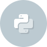

This is a collection of code projects I made on Codecademy.

##  APIs

- [bitly API script - Python 2](https://github.com/christianheinrichs/codecademy-projects/tree/master/APIs/bitly_py2.py)
- [bitly API script - Python 3](https://github.com/christianheinrichs/codecademy-projects/tree/master/APIs/bitly_py3.py)
- [placekitten script - Python 2](https://github.com/christianheinrichs/codecademy-projects/tree/master/APIs/placekitten_py2.py)
- [placekitten script - Python 3](https://github.com/christianheinrichs/codecademy-projects/tree/master/APIs/placekitten_py3.py)

##  HTML & CSS
- No projects yet

## [ JavaScript](https://github.com/christianheinrichs/codecademy-projects/tree/master/JavaScript)
- [Cash register](https://github.com/christianheinrichs/codecademy-projects/tree/master/JavaScript/Cash_register)
- [Rock, Paper, Scissors](https://github.com/christianheinrichs/codecademy-projects/tree/master/JavaScript/Rock_Paper_Scissors)

##  jQuery
- No projects yet

##  PHP
- No projects yet

## [ Python](https://github.com/christianheinrichs/codecademy-projects/tree/master/Python)
- [Battleship - Python 2](https://github.com/christianheinrichs/codecademy-projects/tree/master/Python/battleship_py2.py)
- [Battleship - Python 3](https://github.com/christianheinrichs/codecademy-projects/tree/master/Python/battleship_py3.py)
- [Pyg Latin Translator (PLT) - Python 2](https://github.com/christianheinrichs/codecademy-projects/tree/master/Python/plt_py2.py)
- [Pyg Latin Translator (PLT) - Python 3](https://github.com/christianheinrichs/codecademy-projects/tree/master/Python/plt_py3.py)

##  Ruby
- [Duckifier](Ruby/duckifier.rb)
- [Redactor program](Ruby/redact_it.rb)

## [ Web Projects](https://github.com/christianheinrichs/codecademy-projects/tree/master/Web_Projects)
- [CSS Buttons](https://github.com/christianheinrichs/codecademy-projects/tree/master/Web_Projects/CSS_Buttons)
- [Checking Input](https://github.com/christianheinrichs/codecademy-projects/tree/master/Web_Projects/Checking_Input)
- [Client-Side Form Validation](https://github.com/christianheinrichs/codecademy-projects/tree/master/Web_Projects/Client-Side_Form_Validation)
- [Date Picker](https://github.com/christianheinrichs/codecademy-projects/tree/master/Web_Projects/Date_Picker)
- [Draw with JavaScript](https://github.com/christianheinrichs/codecademy-projects/tree/master/Web_Projects/Draw_with_JavaScript)
- [Web Form](https://github.com/christianheinrichs/codecademy-projects/tree/master/Web_Projects/Web_Form)

Program icons © 2014 Codecademy
